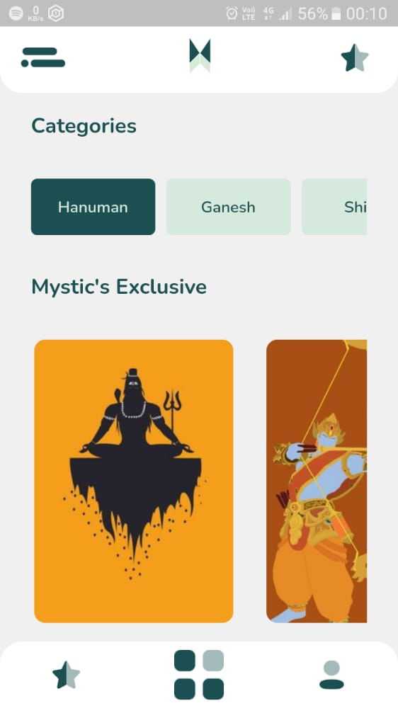
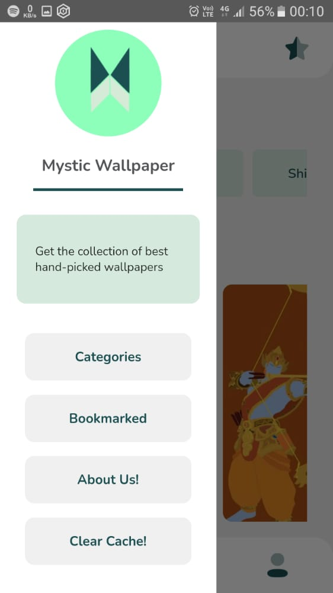
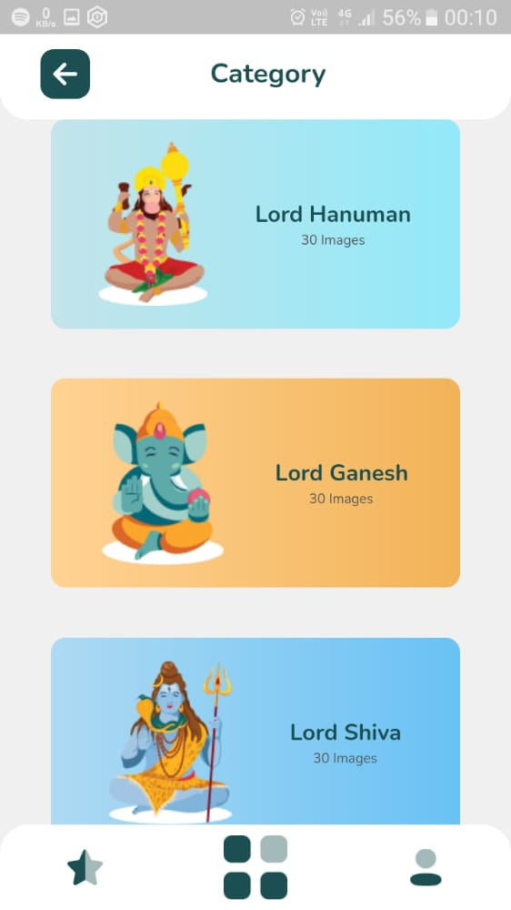
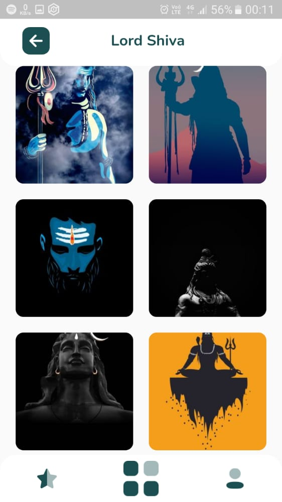
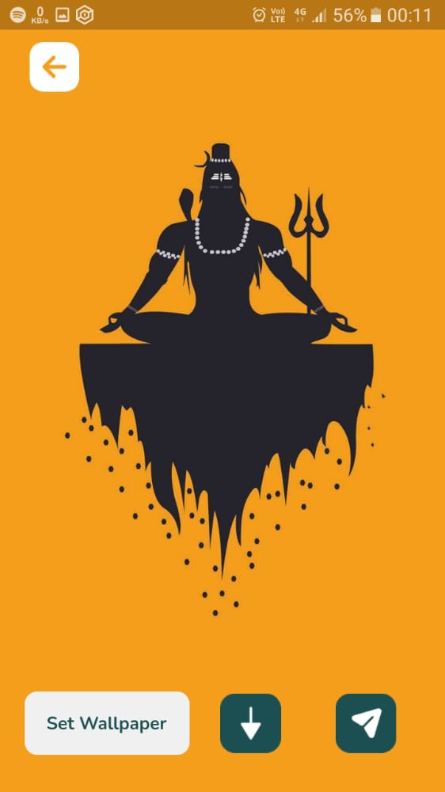

# Mystic Wallpaper

This is a wallpaper app of Hindu God's with Beautiful UI and good performance. 

## Getting Started

### Screenshots:

              

  


### Folder Structure

```
📦lib
 ┣ 📂config - this folder contains colors, text styles and other constants.
 ┣ 📂models - this folder contains all the models used in this app
 ┣ 📂provider - this folder calls api, converts to model objects and it uses riverpod to provide this				data to UI.
 ┣ 📂routes - all the routes
 ┣ 📂screens - all the screens of this app
 ┃ ┣ 📂about_us
 ┃ ┣ 📂bookmarked
 ┃ ┣ 📂category
 ┃ ┃ ┣ 📂widget - widgets used for category screen
 ┃ ┣ 📂global_widgets - widgets common to all screens
 ┃ ┣ 📂god_wallpaper
 ┃ ┣ 📂home
 ┃ ┃ ┣ 📂widgets
 ┃ ┣ 📂set_wallpaper
 ┃ ┗ 📂sidebar
 ┗ 📜main.dart
```

```english
/* Copyright (C) by Author: Aman Kumar(thisisamank), - All Rights Reserved
 * Unauthorized copying of this file, via any medium is strictly prohibited
 * Proprietary and confidential
 * Written by Aman Kumar <thisisamank@gmail.com>, December 2020
 */
```

